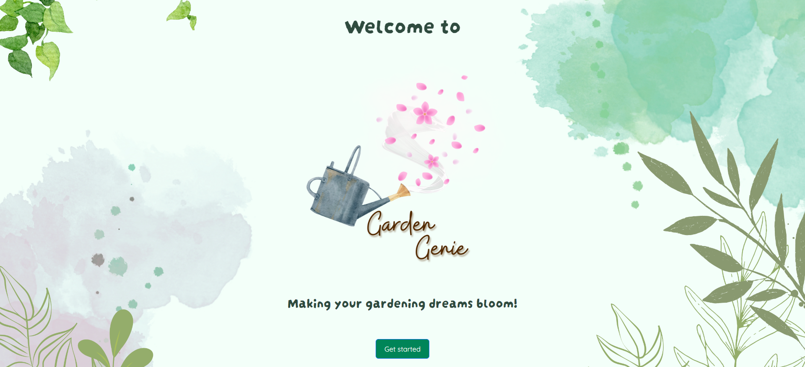

# Garden Genie Frontend

For the final full stack project at the School of Code, my team had the opportunity to address a real-world problem and plan, design and develop a full-stack web app within five weeks.

### The challenge:
Simplify gardening for individuals, addressing the common barriers that often deter people from starting their gardening journey.

### Our solution:
An app that delivers personalised plant recommendations based on user preferences. On the frontend, we harnessed the power of React for its code reusability, state management, and seamless deployment, to create a high-functionint frontend. For the backend, we efficiently managed plant data using Node, Express, and MongoDB in a non-relational database.


## Website Link

You can visit the deployed website here:

[Deployed Website Link](https://garden-genie.netlify.app/)


## Logo


## Screenshots




## Installation

This project was bootstrapped with [Create React App](https://github.com/facebook/create-react-app).

Install my-project with npm:

```bash
  npm install my-project
  cd my-project
```


    
## Run Locally

Clone the project:

```bash
  git clone (https://github.com/AnastasiaAdamoudi/M.A.S.H.E.D_Garden_Genie)
```

Go to the project directory:

```bash
  cd my-project
```

Install dependencies:

```bash
  npm install
```

Start the server:

```bash
  npm run start
```

Open [http://localhost:3000](http://localhost:3000) to view it in your browser.


## Server

To run the app locally along with its server, follow the instructions on the relevant repo to also start the server: [GardenGenieBackend](https://github.com/AnastasiaAdamoudi/GardenGenieBackend).


## Tech Stack

**Design:** Figma, Canva

**Collaboration:** Git, Trello

**Development:** React.js, CSS, Bootstrap, Testing Library


## Contributors

- [@Mateen](https://github.com/MateenSQ)
- [@Saad](https://github.com/saadash1268)
- [@Harsham](https://github.com/h4rsham)
- [@Eric](https://github.com/Pixiebaba)
- [@Deeqa](https://github.com/DeeqaJamalini)


